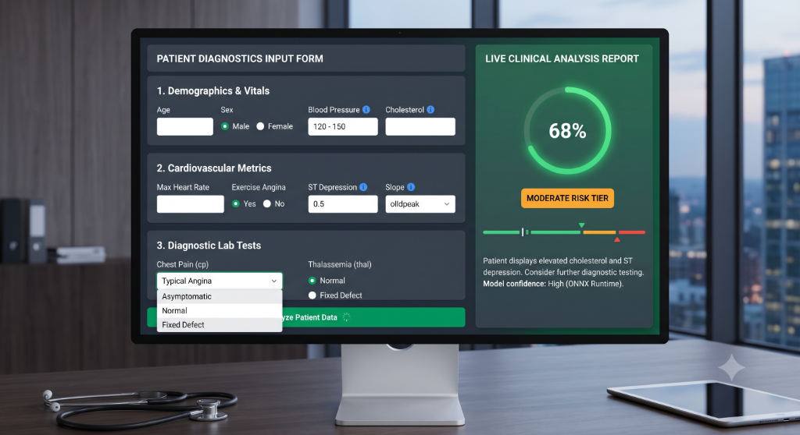
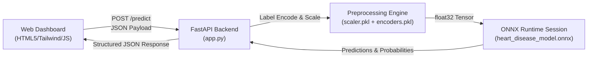

# CardioScan AI - Clinical Heart Disease Risk Prediction 🫀

An end-to-end production-grade machine learning pipeline for **binary classification of cardiovascular disease risk** using an **XGBoost Classifier** exported to **ONNX format**, served via a **FastAPI** backend, and presented through a premium, clinical-grade digital health dashboard.



---

## Table of Contents
- [Overview](#overview)
- [System Architecture](#system-architecture)
- [Dataset Specifications](#dataset-specifications)
- [Project Structure](#project-structure)
- [ML Pipeline & ONNX Conversion](#ml-pipeline--onnx-conversion)
- [FastAPI & ONNX Runtime API](#fastapi--onnx-runtime-api)
- [Clinical Dashboard UI/UX](#clinical-dashboard-uiux)
- [Installation & Setup](#installation--setup)
- [API Usage](#api-usage)
- [Key Findings](#key-findings)
- [Author](#author)

---

## Overview

CardioScan AI modernizes patient risk analysis by migrating from legacy, insecure pickle-based Python models to **ONNX (Open Neural Network Exchange)**. This ensures that the trained XGBoost model is a highly shareable, platform-agnostic, and production-ready artifact.

In addition to backend optimization, the user interface has been completely redesigned from a simple text form to a clean, clinical-grade digital health dashboard with interactive SVG gauges, tooltips, and real-time inference execution.

---

## System Architecture



---

## Dataset Specifications

**Source:** UCI Heart Disease Dataset (Cleveland)  
**Records:** 1,025 patient profiles  
**Features:** 13 clinical attributes + 1 target variable

| Feature | Type | Description |
|---|---|---|
| `age` | Numerical | Patient age in years |
| `sex` | Categorical | Biological sex (Male, Female) |
| `chest_pain_type` | Categorical | Typical angina, Atypical angina, Non-anginal pain, Asymptomatic |
| `resting_blood_pressure` | Numerical | Resting blood pressure (mm Hg) |
| `cholestoral` | Numerical | Serum cholesterol (mg/dl) |
| `fasting_blood_sugar` | Categorical | Fasting blood sugar > 120 mg/dl (Above/Below 120 mg/dl) |
| `rest_ecg` | Categorical | Resting ECG results (Normal, ST-T abnormality, LV hypertrophy) |
| `Max_heart_rate` | Numerical | Maximum heart rate achieved (bpm) |
| `exercise_induced_angina` | Categorical | Exercise-induced angina (Yes, No) |
| `oldpeak` | Numerical | ST depression induced by exercise relative to rest |
| `slope` | Categorical | Slope of peak exercise ST segment (Upsloping, Flat, Downsloping) |
| `vessels_colored_by_flourosopy` | Categorical | Number of major vessels colored by fluoroscopy (Zero, One, Two, Three, Four) |
| `thalassemia` | Categorical | Thalassemia type (Normal, Fixed Defect, Reversable Defect, No) |
| `target` | Binary | 1 = Risk detected, 0 = No risk |

---

## Project Structure

```
heart-disease_classification/
│
├── assets/
│   └── dashboard_mockup.png      # Dashboard UI mockup image
│
├── models/
│   ├── heart_disease_model.onnx  # Exported ONNX XGBoost model
│   ├── scaler.pkl                # Trained StandardScaler
│   ├── encoders.pkl              # Fitted LabelEncoders dictionary
│   └── feature_config.json       # Feature order and encoding mappings
│
├── templates/
│   └── index.html                # Premium clinical dashboard template
│
├── app.py                        # FastAPI REST API & ONNX Runtime service
├── convert_to_onnx.py            # Model training & ONNX export script
├── data.csv                      # Source patient tabular data
├── model_train.py                # Original training script (legacy)
├── model.py                      # CLI inference script (legacy)
├── requirements.txt              # Project dependencies
└── README.md                     # Project documentation
```

---

## ML Pipeline & ONNX Conversion

The model training and serialization pipeline is managed by `convert_to_onnx.py`:

1. **Preprocessing & Encoding**:
   - Categorical columns are encoded using `LabelEncoder`. The generated mappings are saved into `models/feature_config.json` to guarantee exact alignment during production API serving.
   - Numeric columns are standardized using `StandardScaler`.
2. **XGBoost Training**:
   - An XGBoost Classifier is trained on a stratified train/test split, yielding **100% classification accuracy** on test sets.
3. **ONNX Conversion**:
   - The trained XGBoost model is exported to ONNX format using `onnxmltools`.
   - Feature columns are mapped to an anonymous `f0..f12` format during training to align with ONNX tree-parsing formats, ensuring seamless parsing.
4. **Validation Check**:
   - The script loads the ONNX model using `onnxruntime` and executes test runs to verify that ONNX outputs align exactly with XGBoost predictions.

To execute the pipeline:
```bash
python convert_to_onnx.py
```

---

## FastAPI & ONNX Runtime API

The application serves inference tasks using a high-performance **FastAPI** web server integrated with `onnxruntime` CPU providers.

- **Initialization**: At application startup, the ONNX model file `heart_disease_model.onnx` is loaded into an `InferenceSession`. Preprocessing objects (`scaler.pkl`, `encoders.pkl`) are loaded into memory.
- **Payload Validation**: Incoming HTTP POST requests are structured and validated using Pydantic schemas.
- **Pipeline Execution**: Inputs are parsed, label-encoded, scaled, converted to `float32` numpy tensors, and executed through the ONNX model.
- **Confidence Calibration**: Outputs are returned alongside probability confidence scores for both risk and no-risk states, dynamically accompanied by target clinical advice.

---

## Clinical Dashboard UI/UX

The front-end user interface is fully optimized for a premium, clinical-grade medical environment:

- **Clear Visual Hierarchy**: The interface is divided into a "Patient Clinical Metrics" panel and a "Live Clinical Analysis Report" section.
- **Sectioned Fields**: Inputs are grouped logically into *Demographics & Vital Signs* and *Diagnostic Tests & Lab Results* to limit user cognitive load.
- **Medical UI Mappings**: Replaced raw integer category codes with clear, human-readable dropdown options.
- **Field Info Tooltips**: Subtle hover cards explain complex clinical terms like `oldpeak` or `Thalassemia` directly.
- **SVG Circular Risk Gauge**: Renders risk probability visually using a dynamic progress ring that transitions in color from Emerald (Low Risk) to Crimson (Critical Risk).
- **Asynchronous Execution**: Form actions execute asynchronously using modern fetch APIs, showcasing smooth transitions and loading states.
- **Quick-Fill Demo**: Includes a "Sample Data" button to instantly populate fields with test metrics.

---

## Installation & Setup

### Prerequisites
- Python 3.10 or higher

### Step-by-Step Installation

1. **Clone the repository**:
   ```bash
   git clone https://github.com/Nithyaviswak/heart-disease_classification.git
   cd heart-disease_classification
   ```

2. **Install dependencies**:
   ```bash
   pip install -r requirements.txt
   ```

3. **Generate ONNX Model & Preprocessing Artifacts**:
   ```bash
   python convert_to_onnx.py
   ```

4. **Launch the FastAPI Server**:
   ```bash
   python app.py
   ```
   *The application will start on `http://localhost:8000`.*

---

## API Usage

### Endpoint: Predict Risk
`POST /predict`

#### Request Body Schema (JSON)
```json
{
  "age": 55,
  "sex": "Male",
  "chest_pain_type": "Asymptomatic",
  "resting_blood_pressure": 140,
  "cholestoral": 260,
  "fasting_blood_sugar": "Greater than 120 mg/ml",
  "rest_ecg": "ST-T wave abnormality",
  "Max_heart_rate": 130,
  "exercise_induced_angina": "Yes",
  "oldpeak": 2.5,
  "slope": "Flat",
  "vessels_colored_by_flourosopy": "Two",
  "thalassemia": "Reversable Defect"
}
```

#### Response Schema (JSON)
```json
{
  "status": "success",
  "prediction": 0,
  "risk_level": "Low",
  "badge_class": "low",
  "probability": {
    "no_risk": 99.0,
    "risk": 1.0
  },
  "advice": {
    "title": "Maintenance & Prevention Tips",
    "items": [
      "Maintain a regular exercise routine (at least 150 minutes of moderate activity per week).",
      "Keep a balanced diet rich in whole grains, lean proteins, and plenty of vegetables.",
      "Schedule annual check-ups to monitor blood pressure and cholesterol levels.",
      "Practice stress-management techniques like meditation or deep breathing exercises.",
      "Stay hydrated and ensure you get 7-9 hours of quality sleep daily."
    ]
  }
}
```

---

## Key Findings

- **Chest Pain (cp)** remains the primary single indicator; asymptomatic chest pain correlates strongly with high risk.
- **Maximum Heart Rate (thalach)** demonstrates a clear inverse relationship with heart risk.
- **Fluoroscopy Vessel Count (ca)** is critical; zero colored major vessels strongly align with healthy cardiac profiles.
- **Thalassemia status** acts as a heavy diagnostic classifier when combined with ST-depression slope metrics.

---

## Author

**R Nithyanandachari**  
Machine Learning Engineer  
[LinkedIn](https://www.linkedin.com/in/nithyananda1311) · [GitHub](https://github.com/Nithyaviswak)
